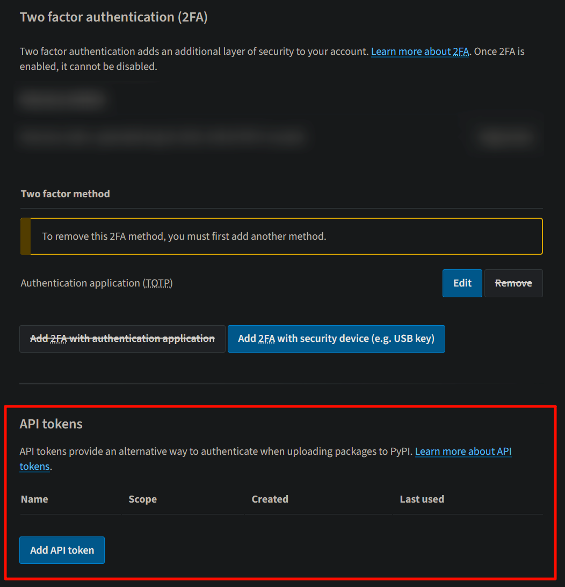

# 发布插件

现在, 待您编写完成并测试之后, 让我们来发布插件吧!
> 本章设计 Pypi 账户, 若您无, 请前往 <https://pypi.org/account/register/> 注册

## 创建并设置 Pypi Token
### 创建 Pypi Token
Pypi Token 用于账户验证, 以便 依赖管理和打包工具 以您的身份发布包
> [!DANGER]
> 请勿将该 token 发送给任何人, 否则, 可能导致您的账户被盗用 <br>
> 并且, 无论您的账户是否启用 2FA[^2fa], 使用 token 均无需再次验证即可操作该 token 所拥有的权限 (不同 token 可配置不同的权限)

#### 1. 登录您的 Pypi
打开 <https://pypi.org> 登录您的账户 (若无, 应当自行注册, 请参阅 [发布插件](#发布插件))

#### 2. 新建 Pypi Token
登录完成后, 单击右上方您的用户名以打开下拉菜单, 并单击 `Account Settings` 跳转至账户管理页面 (如下图)<br>
*(或直接打开 <https://pypi.org/manage/account/>)*


向下滚动滚轮或拖动滑条, 找到 `API tokens` 设置板块 (如下图)


单击上方蓝色的 `Add API token` 按钮, 跳转至 创建 API token (`Create API token`) 页面 (如下图)


其中, `Token name` (必填) 字段 代表了您的 Pypi Token 的名称, 应当符合其作用, 或您自己能够理解 <br>
`Scope` (必选) 选择框代表了该 token 的 作用范围, 一般情况下, 由于您未在 Pypi 发过 本包, 故只能选择 账户所有权 (所有项目) (`Entire account (all projects)`), 如下图所示


最后, 单击蓝色 `Create token` 按钮即可创建 Token, 您需要将其复制下来, 并妥善保管

### 配置 依赖管理和打包工具 (`Poetry`)
打开项目所在 Python 环境, 然后运行如下指令:
```shell
poetry config pypi-token.pypi <token>
```
其中, `token` 代表了您刚才创建的 Pypi Token, 无需加上两侧尖括号

### 构建, 发布 与 更改版本号
#### 构建
作为一个 Python 包, 在上传至 Pypi 前需要构建
一般的, 运行如下命令即可完成构建
```shell
poetry build
```

如果您在项目根目录 自动生成的 `dist` 文件夹中看到了 `<您的包名>-<您的包的版本号>-py<数字>-<一些字符>.whl` 和 `<您的包名>-<您的包的版本号>.tar.gz`, 即代表构建成功

### 发布
构建成功后, 运行如下指令即可将包发布至 Pypi
> 请注意: 无法发布同名包, 如果在 Pypi 已经存在了同名包, 您应当修改 `pyproject.toml` 以修改包名 (字段含义请参阅 [初始化包与包配置文件](START.md#初始化包与包配置文件))
```shell
poetry publish
```

> [!NOTE]
> 您可以运行 `poetry build --publish` 以在构建成功后自动发布 <br>
> 当构建失败时, `poetry` 会停止流程

#### 更改版本号
同一个包的同一个版本号也只能发布一次, 当你修改过插件后, 你必须更新版本号才能重新发布.
运行如下命令以更改版本号:
```shell
poetry version <版本号>
```
其中, `版本号` 一般应当为 三个整数以 `.` 分割, 如 `1.2.3` <br>
在版本号中, `1` 被叫做 大版本 (`major`), `2` 被叫做 中版本 (`minor`), `3` 被叫做 小版本 (`patch`) <br>
一般规定, 大版本为 `0` 的为 `beta` 版本

更多 `poetry version` 的详细用法, 请参阅 [Commands | Documentation | Poetry - Python dependency management and packaging made easy](https://python-poetry.org/docs/cli/#version)

## 注解
[^2fa]: <https://blog.pypi.org/posts/2023-05-25-securing-pypi-with-2fa/>

## 参考资料
1. <https://python-poetry.org/docs/repositories/#configuring-credentials>
2. <https://koishi.chat/zh-CN/guide/develop/publish.html#更新插件版本>
